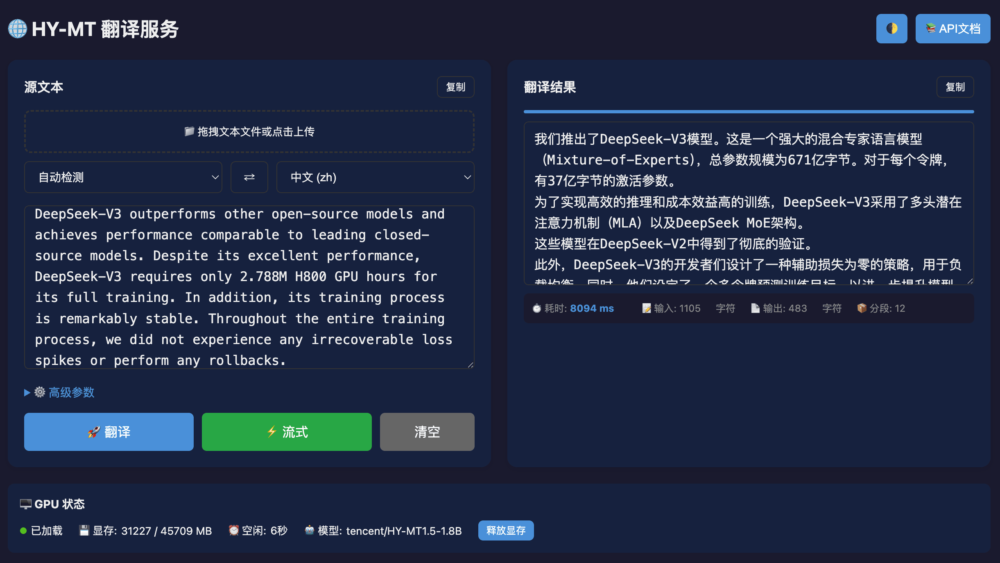

<p align="center">
  
</p>

<p align="center">
  <b>English</b> | <a href="README_CN.md">简体中文</a> | <a href="README_TW.md">繁體中文</a> | <a href="README_JP.md">日本語</a>
</p>

<p align="center">
  <a href="https://hub.docker.com/r/neosun/hy-mt"></a>
  <a href="https://github.com/neosun100/hy-mt/stargazers"></a>
  <a href="https://github.com/neosun100/hy-mt/blob/main/License.txt"></a>
  <a href="https://huggingface.co/tencent/HY-MT1.5-1.8B"></a>
</p>

# HY-MT Translation Service

> 🚀 All-in-One Docker deployment for Tencent HunyuanMT 1.5 translation model with Web UI, REST API, and MCP Server support.

## ✨ Features

- 🌐 **38 Languages Support** - Chinese, English, Japanese, Korean, French, German, Spanish, and 31 more
- 🎨 **Modern Web UI** - Dark/Light theme toggle, drag & drop file upload, real-time progress display
- ⚡ **Streaming Translation** - Server-Sent Events (SSE) for real-time output, perfect for long texts
- 🔧 **Full Parameter Control** - Temperature, Top-P, Top-K, repetition penalty adjustable
- 📚 **Terminology Intervention** - Custom term mapping for domain-specific translations
- 🤖 **MCP Server** - Model Context Protocol support for AI assistants (Claude, etc.)
- 🐳 **One-Click Deployment** - All-in-One Docker image with model auto-download
- 🔄 **Smart GPU Management** - Auto GPU selection, idle timeout, memory release

## 📸 Screenshot

<p align="center">
  
</p>

## 🚀 Quick Start

### Docker Run (Recommended)

```bash
# One command to start
docker run -d --gpus all \
  -p 8021:8021 \
  -v ./models:/app/models \
  --name hy-mt \
  neosun/hy-mt:latest

# Access Web UI
open http://localhost:8021
```

The model (~3.5GB) will be automatically downloaded on first run.

### Docker Compose

Create `docker-compose.yml`:

```yaml
services:
  hy-mt:
    image: neosun/hy-mt:latest
    container_name: hy-mt
    ports:
      - "8021:8021"
    environment:
      - MODEL_NAME=tencent/HY-MT1.5-1.8B
      - GPU_IDLE_TIMEOUT=300
      - HF_ENDPOINT=https://huggingface.co  # Use https://hf-mirror.com for China
    volumes:
      - ./models:/app/models
    deploy:
      resources:
        reservations:
          devices:
            - driver: nvidia
              count: 1
              capabilities: [gpu]
    restart: unless-stopped
```

```bash
docker compose up -d
```

## 📋 Requirements

| Requirement | Minimum | Recommended |
|-------------|---------|-------------|
| GPU | NVIDIA GPU with 6GB+ VRAM | 8GB+ VRAM |
| CUDA | 11.8+ | 12.4+ |
| Docker | 20.10+ | 24.0+ |
| nvidia-docker | Required | - |

### Verify GPU Support

```bash
# Check NVIDIA driver
nvidia-smi

# Check Docker GPU support
docker run --rm --gpus all nvidia/cuda:12.4.1-base-ubuntu22.04 nvidia-smi
```

## ⚙️ Configuration

### Environment Variables

| Variable | Default | Description |
|----------|---------|-------------|
| `PORT` | 8021 | Service port |
| `MODEL_NAME` | tencent/HY-MT1.5-1.8B | HuggingFace model name |
| `MODEL_PATH` | ./models | Local model cache path |
| `GPU_IDLE_TIMEOUT` | 300 | Auto-release GPU after idle (seconds) |
| `NVIDIA_VISIBLE_DEVICES` | auto | GPU ID (empty = auto select) |
| `HF_ENDPOINT` | https://huggingface.co | HuggingFace mirror URL |

### Using .env File

```bash
# Copy example config
cp .env.example .env

# Edit as needed
vim .env
```

## 📖 API Usage

### Basic Translation

```bash
curl -X POST "http://localhost:8021/api/translate" \
  -H "Content-Type: application/json" \
  -d '{
    "text": "Hello, how are you?",
    "target_lang": "zh"
  }'
```

Response:
```json
{
  "status": "success",
  "result": "你好，你好吗？",
  "elapsed_ms": 1234,
  "chunks": 1
}
```

### Streaming Translation (SSE)

```bash
curl -N "http://localhost:8021/api/translate" \
  -H "Content-Type: application/json" \
  -d '{
    "text": "Long article to translate...",
    "target_lang": "en",
    "stream": true
  }'
```

### With Terminology Intervention

```bash
curl -X POST "http://localhost:8021/api/translate" \
  -H "Content-Type: application/json" \
  -d '{
    "text": "Apple released iPhone 16",
    "target_lang": "zh",
    "terms": {"Apple": "苹果公司", "iPhone": "苹果手机"}
  }'
```

### File Upload Translation

```bash
curl "http://localhost:8021/api/translate/file" \
  -F "file=@document.txt" \
  -F "target_lang=zh" \
  -F "stream=true"
```

## 📚 API Endpoints

| Endpoint | Method | Description |
|----------|--------|-------------|
| `/` | GET | Web UI |
| `/api/translate` | POST | Translate text (supports streaming) |
| `/api/translate/file` | POST | Upload and translate file |
| `/api/translate/batch` | POST | Batch translation |
| `/api/languages` | GET | List supported languages |
| `/api/gpu/status` | GET | GPU status and memory info |
| `/api/gpu/offload` | POST | Release GPU memory |
| `/health` | GET | Health check |
| `/docs` | GET | Swagger API documentation |

## 🔑 Key Optimization: Chunk Size

**Critical finding**: Smaller chunk size = Better translation quality

| Chunk Size | Quality | Notes |
|-----------|---------|-------|
| 500 chars | ❌ Poor | Mixed languages in output |
| 300 chars | ⚠️ Fair | Some untranslated residue |
| **150 chars** | ✅ Excellent | Complete, accurate translation |

The service uses `MAX_CHUNK_LENGTH=150` by default for optimal quality.

See [Optimization Guide](docs/OPTIMIZATION_GUIDE.md) for details.

## 🌍 Supported Languages

| Language | Code | Language | Code | Language | Code |
|----------|------|----------|------|----------|------|
| Chinese | zh | English | en | Japanese | ja |
| Korean | ko | French | fr | German | de |
| Spanish | es | Portuguese | pt | Russian | ru |
| Arabic | ar | Thai | th | Vietnamese | vi |
| Italian | it | Dutch | nl | Polish | pl |
| Turkish | tr | Indonesian | id | Malay | ms |
| Hindi | hi | Traditional Chinese | zh-Hant | Cantonese | yue |

And 17 more languages. See `/api/languages` for full list.

## 🛠️ Tech Stack

- **Model**: [Tencent HY-MT1.5-1.8B](https://huggingface.co/tencent/HY-MT1.5-1.8B)
- **Backend**: FastAPI + Uvicorn
- **Frontend**: Vanilla JS with Dark/Light Mode
- **Container**: NVIDIA CUDA 12.4 base image
- **Streaming**: Server-Sent Events (SSE)
- **MCP**: Model Context Protocol for AI integration

## 📁 Project Structure

```
hy-mt/
├── app_fastapi.py      # Main FastAPI application
├── mcp_server.py       # MCP Server for AI assistants
├── templates/
│   └── index.html      # Web UI (Dark/Light theme)
├── docs/
│   ├── OPTIMIZATION_GUIDE.md  # Long text optimization guide
│   └── QUICK_REFERENCE.md     # API quick reference
├── Dockerfile          # All-in-One Docker build
├── docker-compose.yml  # Docker Compose config
├── start.sh           # Quick start script
├── test_api.sh        # API test script
└── .env.example       # Environment config template
```

## 🔧 Advanced Usage

### Manual Start (Development)

```bash
# Clone repository
git clone https://github.com/neosun100/hy-mt.git
cd hy-mt

# Install dependencies
pip install torch transformers accelerate fastapi uvicorn

# Run
python -m uvicorn app_fastapi:app --host 0.0.0.0 --port 8021
```

### MCP Server Integration

For AI assistants like Claude Desktop, add to MCP config:

```json
{
  "mcpServers": {
    "hy-mt": {
      "command": "python",
      "args": ["/path/to/hy-mt/mcp_server.py"],
      "env": {
        "HY_MT_API": "http://localhost:8021"
      }
    }
  }
}
```

See [MCP_GUIDE.md](MCP_GUIDE.md) for details.

## 🐛 Troubleshooting

| Issue | Solution |
|-------|----------|
| Model download slow | Set `HF_ENDPOINT=https://hf-mirror.com` (China mirror) |
| GPU out of memory | Use quantized model: `tencent/HY-MT1.5-1.8B-FP8` |
| Container won't start | Check `nvidia-smi` and nvidia-docker installation |
| Translation incomplete | Already optimized with chunk size 150 |

## 📝 Changelog

### v1.0.0 (2026-01-03)
- 🎉 Initial release
- ✨ All-in-One Docker image
- ⚡ Streaming translation with SSE
- 🎨 Dark/Light theme Web UI
- 🔧 Long text optimization (chunk size 150)
- 🤖 MCP Server support

## 🤝 Contributing

Contributions are welcome! Please feel free to submit a Pull Request.

1. Fork the repository
2. Create your feature branch (`git checkout -b feature/AmazingFeature`)
3. Commit your changes (`git commit -m 'Add some AmazingFeature'`)
4. Push to the branch (`git push origin feature/AmazingFeature`)
5. Open a Pull Request

## 📄 License

This project is based on [Tencent HunyuanMT](https://github.com/Tencent-Hunyuan/HY-MT). See [License.txt](License.txt) for details.

## 🙏 Acknowledgments

- [Tencent Hunyuan](https://github.com/Tencent-Hunyuan/HY-MT) - Original HY-MT model
- [HuggingFace](https://huggingface.co/tencent/HY-MT1.5-1.8B) - Model hosting

---

## ⭐ Star History

[](https://star-history.com/#neosun100/hy-mt)

## 📱 Follow Us

<p align="center">
  
</p>
