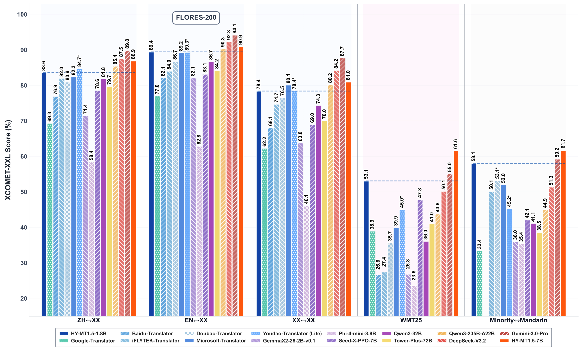

<p align="left">
    <a href="README_CN.md">中文</a>&nbsp ｜ English</a>
</p>
<br><br>

<p align="center">
  <br>
</p><p></p>


<p align="center">
    🤗&nbsp;<a href="https://huggingface.co/collections/tencent/hy-mt15"><b>Hugging Face</b></a>&nbsp;&nbsp;|&nbsp;&nbsp;
    &nbsp;<a href="https://modelscope.cn/collections/Tencent-Hunyuan/HY-MT15"><b>ModelScope</b></a>&nbsp;&nbsp;|&nbsp;&nbsp;
</p>

<p align="center">
    🖥️&nbsp;<a href="https://hunyuan.tencent.com" style="color: red;"><b>Official Website</b></a>&nbsp;&nbsp;|&nbsp;&nbsp;
    🕹️&nbsp;<a href="https://hunyuan.tencent.com/chat/HunyuanDefault?from=modelSquare&modelId=hunyuan-mt-1.8b"><b>Demo</b></a>&nbsp;&nbsp;&nbsp;&nbsp;
</p>

<p align="center">
    <a href="https://github.com/Tencent-Hunyuan/HY-MT"><b>GITHUB</b></a>
</p>


## Model Introduction

Hunyuan Translation Model Version 1.5 includes a 1.8B translation model, HY-MT1.5-1.8B, and a 7B translation model, HY-MT1.5-7B. Both models focus on supporting mutual translation across 33 languages and incorporating 5 ethnic and dialect variations. Among them, HY-MT1.5-7B is an upgraded version of our WMT25 championship model, optimized for explanatory translation and mixed-language scenarios, with newly added support for terminology intervention, contextual translation, and formatted translation. Despite having less than one-third the parameters of HY-MT1.5-7B, HY-MT1.5-1.8B delivers translation performance comparable to its larger counterpart, achieving both high speed and high quality. After quantization, the 1.8B model can be deployed on edge devices and support real-time translation scenarios, making it widely applicable.

## Key Features and Advantages

- HY-MT1.5-1.8B achieves the industry-leading performance among models of the same size, surpassing most commercial translation APIs.
- HY-MT1.5-1.8B supports deployment on edge devices and real-time translation scenarios, offering broad applicability.
- HY-MT1.5-7B, compared to its September open-source version, has been optimized for annotated and mixed-language scenarios.
- Both models support terminology intervention, contextual translation, and formatted translation.

## Related News
* 2025.12.30, we have open-sourced **HY-MT1.5-1.8B** and **HY-MT1.5-7B** on Hugging Face.
* 2025.9.1, we have open-sourced  **Hunyuan-MT-7B** , **Hunyuan-MT-Chimera-7B** on Hugging Face.
<br>


## Performance

<div align='center'>

</div>
You can refer to our technical report for more experimental results and analysis.

<a href=./HY_MT1_5_Technical_Report.pdf><b>Technical Report</b> </a>

&nbsp;

## Model Links
| Model Name  | Description | Download |
| ----------- | ----------- |-----------
| HY-MT1.5-1.8B  | Hunyuan 1.8B translation model |🤗 [Model](https://huggingface.co/tencent/HY-MT1.5-1.8B)|
| HY-MT1.5-1.8B-FP8 | Hunyuan 1.8B translation model, fp8 quant    | 🤗 [Model](https://huggingface.co/tencent/HY-MT1.5-1.8B-FP8)|
| HY-MT1.5-1.8B-GPTQ-Int4 | Hunyuan 1.8B translation model, int4 quant    | 🤗 [Model](https://huggingface.co/tencent/HY-MT1.5-1.8B-GPTQ-Int4)|
| HY-MT1.5-7B | Hunyuan 7B translation model    | 🤗 [Model](https://huggingface.co/tencent/HY-MT1.5-7B)|
| HY-MT1.5-7B-FP8 | Hunyuan 7B translation model, fp8 quant     | 🤗 [Model](https://huggingface.co/tencent/HY-MT1.5-7B-FP8)|
| HY-MT1.5-7B-GPTQ-Int4 | Hunyuan 7B translation model, int4 quant     | 🤗 [Model](https://huggingface.co/tencent/HY-MT1.5-7B-GPTQ-Int4)|

## Prompts

### Prompt Template for ZH<=>XX Translation.
---
```
将以下文本翻译为{target_language}，注意只需要输出翻译后的结果，不要额外解释：

{source_text}
```
---

### Prompt Template for XX<=>XX Translation, excluding ZH<=>XX.
---
```
Translate the following segment into {target_language}, without additional explanation.

{source_text}
```
---

### Prompt Template for terminology intervention.
---
```
参考下面的翻译：
{source_term} 翻译成 {target_term}

将以下文本翻译为{target_language}，注意只需要输出翻译后的结果，不要额外解释：
{source_text}
```
---

### Prompt Template for contextual translation.
---
```
{context}
参考上面的信息，把下面的文本翻译成{target_language}，注意不需要翻译上文，也不要额外解释：
{source_text}

```
---

###  Prompt Template for formatted translation.
---
```
将以下<source></source>之间的文本翻译为中文，注意只需要输出翻译后的结果，不要额外解释，原文中的<sn></sn>标签表示标签内文本包含格式信息，需要在译文中相应的位置尽量保留该标签。输出格式为：<target>str</target>

<source>{src_text_with_format}</source>
```
---

&nbsp;

### Use with transformers
First, please install transformers, recommends v4.56.0
```SHELL
pip install transformers==4.56.0
```

*!!! If you want to load fp8 model with transformers, you need to change the name"ignored_layers" in config.json to "ignore" and upgrade the compressed-tensors to compressed-tensors-0.11.0.*

The following code snippet shows how to use the transformers library to load and apply the model.

we use tencent/HY-MT1.5-1.8B for example

```python
from transformers import AutoModelForCausalLM, AutoTokenizer
import os

model_name_or_path = "tencent/HY-MT1.5-1.8B"

tokenizer = AutoTokenizer.from_pretrained(model_name_or_path)
model = AutoModelForCausalLM.from_pretrained(model_name_or_path, device_map="auto")  # You may want to use bfloat16 and/or move to GPU here
messages = [
    {"role": "user", "content": "Translate the following segment into Chinese, without additional explanation.\n\nIt’s on the house."},
]
tokenized_chat = tokenizer.apply_chat_template(
    messages,
    tokenize=True,
    add_generation_prompt=False,
    return_tensors="pt"
)

outputs = model.generate(tokenized_chat.to(model.device), max_new_tokens=2048)
output_text = tokenizer.decode(outputs[0])
```

We recommend using the following set of parameters for inference. Note that our model does not have the default system_prompt.

```json
{
  "top_k": 20,
  "top_p": 0.6,
  "repetition_penalty": 1.05,
  "temperature": 0.7
}
```

&nbsp;

Supported languages:
| Languages         | Abbr.   | Chinese Names   |
|-------------------|---------|-----------------|
| Chinese           | zh      | 中文            |
| English           | en      | 英语            |
| French            | fr      | 法语            |
| Portuguese        | pt      | 葡萄牙语        |
| Spanish           | es      | 西班牙语        |
| Japanese          | ja      | 日语            |
| Turkish           | tr      | 土耳其语        |
| Russian           | ru      | 俄语            |
| Arabic            | ar      | 阿拉伯语        |
| Korean            | ko      | 韩语            |
| Thai              | th      | 泰语            |
| Italian           | it      | 意大利语        |
| German            | de      | 德语            |
| Vietnamese        | vi      | 越南语          |
| Malay             | ms      | 马来语          |
| Indonesian        | id      | 印尼语          |
| Filipino          | tl      | 菲律宾语        |
| Hindi             | hi      | 印地语          |
| Traditional Chinese | zh-Hant| 繁体中文        |
| Polish            | pl      | 波兰语          |
| Czech             | cs      | 捷克语          |
| Dutch             | nl      | 荷兰语          |
| Khmer             | km      | 高棉语          |
| Burmese           | my      | 缅甸语          |
| Persian           | fa      | 波斯语          |
| Gujarati          | gu      | 古吉拉特语      |
| Urdu              | ur      | 乌尔都语        |
| Telugu            | te      | 泰卢固语        |
| Marathi           | mr      | 马拉地语        |
| Hebrew            | he      | 希伯来语        |
| Bengali           | bn      | 孟加拉语        |
| Tamil             | ta      | 泰米尔语        |
| Ukrainian         | uk      | 乌克兰语        |
| Tibetan           | bo      | 藏语            |
| Kazakh            | kk      | 哈萨克语        |
| Mongolian         | mn      | 蒙古语          |
| Uyghur            | ug      | 维吾尔语        |
| Cantonese         | yue     | 粤语            |


### Training Data Format

If you need to fine-tune our Instruct model, we recommend processing the data into the following format.

```python

messages = [
    {"role": "system", "content": "You are a helpful assistant."},
    {"role": "user", "content": "Why is seawater salty?" },
    {"role": "assistant", "content": "Seawater is primarily saline due to dissolved salts and minerals. These substances come from the chemical materials in rocks and soil on the Earth's surface, which are carried into the ocean over time. When seawater evaporates, the water vapor leaves, but the salts and minerals remain, making the seawater saltier. Therefore, the salinity of seawater is determined by the amount of salts and minerals it contains."}
]

from transformers import AutoTokenizer
tokenizer = AutoTokenizer.from_pretrained("your_tokenizer_path", trust_remote_code=True)
train_ids = tokenizer.apply_chat_template(messages)
```

&nbsp;

### Train with LLaMA-Factory

In the following chapter, we will introduce how to use `LLaMA-Factory` to fine-tune the `Hunyuan` model.

#### Prerequisites

Verify installation of the following dependencies:
- **LLaMA-Factory**: Follow [official installation guide](https://github.com/hiyouga/LLaMA-Factory)
- **DeepSpeed** (optional): Follow [official installation guide](https://github.com/deepspeedai/DeepSpeed#installation)
- **Transformer Library**: Use the companion branch (Hunyuan-submitted code is pending review)
    ```
    pip install git+https://github.com/huggingface/transformers@4970b23cedaf745f963779b4eae68da281e8c6ca
    ```

#### Data preparation

We need to prepare a custom dataset:
1. Organize your data in `json` format and place it in the `data` directory in `LLaMA-Factory`. The current implementation uses the `sharegpt` dataset format, which requires the following structure:
```
[
  {
    "messages": [
      {
        "role": "system",
        "content": "System prompt (optional)"
      },
      {
        "role": "user",
        "content": "Human instruction"
      },
      {
        "role": "assistant",
        "content": "Model response"
      }
    ]
  }
]
```
Refer to the [Data Format](#training-data-format) section mentioned earlier for details.

2. Define your dataset in the data/dataset_info.json file using the following format:
```
"dataset_name": {
  "file_name": "dataset.json",
  "formatting": "sharegpt",
  "columns": {
    "messages": "messages"
  },
  "tags": {
    "role_tag": "role",
    "content_tag": "content",
    "user_tag": "user",
    "assistant_tag": "assistant",
    "system_tag": "system"
  }
}
```

#### Training execution

1. Copy all files from the `llama_factory_support/example_configs` directory to the `example/hunyuan` directory in `LLaMA-Factory`.
2. Modify the model path and dataset name in the configuration file `hunyuan_full.yaml`. Adjust other configurations as needed:
```
### model
model_name_or_path: [!!!add the model path here!!!]

### dataset
dataset: [!!!add the dataset name here!!!]
```
3. Execute training commands:
    *​​Single-node training​​
    Note: Set the environment variable DISABLE_VERSION_CHECK to 1 to avoid version conflicts.
    ```
    export DISABLE_VERSION_CHECK=1
    llamafactory-cli train examples/hunyuan/hunyuan_full.yaml
    ```
    *Multi-node training​​
    Execute the following command on each node. Configure NNODES, NODE_RANK, MASTER_ADDR, and MASTER_PORT according to your environment:
    ```
    export DISABLE_VERSION_CHECK=1
    FORCE_TORCHRUN=1 NNODES=${NNODES} NODE_RANK=${NODE_RANK} MASTER_ADDR=${MASTER_ADDR} MASTER_PORT=${MASTER_PORT} \
    llamafactory-cli train examples/hunyuan/hunyuan_full.yaml
    ```

&nbsp;


## Quantization Compression
We used our own [AngelSlim](https://github.com/tencent/AngelSlim) compression tool to produce FP8 and INT4 quantization models. `AngelSlim` is a toolset dedicated to creating a more user-friendly, comprehensive and efficient model compression solution.

### FP8 Quantization
We use FP8-static quantization, FP8 quantization adopts 8-bit floating point format, through a small amount of calibration data (without training) to pre-determine the quantization scale, the model weights and activation values will be converted to FP8 format, to improve the inference efficiency and reduce the deployment threshold. We you can use AngelSlim quantization, you can also directly download our quantization completed open source model to use [AngelSlim](https://huggingface.co/AngelSlim).


## Deployment

For deployment, you can use frameworks such as **TensorRT-LLM**, **vLLM**, or **SGLang** to serve the model and create an OpenAI-compatible API endpoint.

image: https://hub.docker.com/r/hunyuaninfer/hunyuan-7B/tags


### TensorRT-LLM

#### Docker Image

We provide a pre-built Docker image based on the latest version of TensorRT-LLM.

We use tencent/Hunyuan-7B-MT for example
- To get started:

```
docker pull docker.cnb.cool/tencent/hunyuan/hunyuan-7b:hunyuan-7b-trtllm
```
```
docker run --privileged --user root --name hunyuanLLM_infer --rm -it --ipc=host --ulimit memlock=-1 --ulimit stack=67108864 --gpus=all hunyuaninfer/hunyuan-7b:hunyuan-7b-trtllm
```

- Prepare Configuration file:

```
cat >/path/to/extra-llm-api-config.yml <<EOF
use_cuda_graph: true
cuda_graph_padding_enabled: true
cuda_graph_batch_sizes:
- 1
- 2
- 4
- 8
- 16
- 32
print_iter_log: true
EOF
```


- Start the API server:


```
trtllm-serve \
  /path/to/HunYuan-7b \
  --host localhost \
  --port 8000 \
  --backend pytorch \
  --max_batch_size 32 \
  --max_num_tokens 16384 \
  --tp_size 2 \
  --kv_cache_free_gpu_memory_fraction 0.6 \
  --trust_remote_code \
  --extra_llm_api_options /path/to/extra-llm-api-config.yml
```


### vllm

#### Start
Please use vLLM version v0.10.0 or higher for inference.

First, please install transformers. We will merge it into the main branch later.
```SHELL
pip install git+https://github.com/huggingface/transformers@4970b23cedaf745f963779b4eae68da281e8c6ca
```

We use tencent/Hunyuan-7B-MT for example
- Download Model file:
  - Huggingface:  will download automicly by vllm.
  - ModelScope: `modelscope download --model Tencent-Hunyuan/Hunyuan-7B-MT`

- model download by huggingface:
```shell
export MODEL_PATH=tencent/Hunyuan-7B-MT
```

- model downloaded by modelscope:
```shell
export MODEL_PATH=/root/.cache/modelscope/hub/models/Tencent-Hunyuan/Hunyuan-7B-MT/
```

- Start the API server:

```shell
python3 -m vllm.entrypoints.openai.api_server \
    --host 0.0.0.0 \
    --port 8000 \
    --trust-remote-code \
    --model ${MODEL_PATH} \
    --tensor-parallel-size 1 \
    --dtype bfloat16 \
    --quantization experts_int8 \
    --served-model-name hunyuan \
    2>&1 | tee log_server.txt
```
- After running service script successfully, run the request script
```shell
curl http://0.0.0.0:8000/v1/chat/completions -H 'Content-Type: application/json' -d '{
"model": "hunyuan",
"messages": [
    {
        "role": "system",
        "content": [{"type": "text", "text": "You are a helpful assistant."}]
    },
    {
        "role": "user",
        "content": [{"type": "text", "text": "请按面积大小对四大洋进行排序，并给出面积最小的洋是哪一个？直接输出结果。"}]
    }
],
"max_tokens": 2048,
"temperature":0.7,
"top_p": 0.6,
"top_k": 20,
"repetition_penalty": 1.05,
"stop_token_ids": [127960]
}'
```
#### Quantitative model deployment
This section describes the process of deploying a post-quantization model using vLLM.

Default server in BF16.

##### Int8 quantitative model deployment
Deploying the Int8-weight-only version of the HunYuan-7B model only requires setting the environment variables

Next we start the Int8 service. Run:
```shell
python3 -m vllm.entrypoints.openai.api_server \
    --host 0.0.0.0 \
    --port 8000 \
    --trust-remote-code \
    --model ${MODEL_PATH} \
    --tensor-parallel-size 1 \
    --dtype bfloat16 \
    --served-model-name hunyuan \
    --quantization experts_int8 \
    2>&1 | tee log_server.txt
```


##### Int4 quantitative model deployment
Deploying the Int4-weight-only version of the HunYuan-7B model only requires setting the environment variables , using the GPTQ method
```shell
export MODEL_PATH=PATH_TO_INT4_MODEL
```
Next we start the Int4 service. Run
```shell
python3 -m vllm.entrypoints.openai.api_server \
    --host 0.0.0.0 \
    --port 8000 \
    --trust-remote-code \
    --model ${MODEL_PATH} \
    --tensor-parallel-size 1 \
    --dtype bfloat16 \
    --served-model-name hunyuan \
    --quantization gptq_marlin \
    2>&1 | tee log_server.txt
```

##### FP8 quantitative model deployment
Deploying the W8A8C8 version of the HunYuan-7B model only requires setting the environment variables


Next we start the FP8 service. Run
```shell
python3 -m vllm.entrypoints.openai.api_server \
    --host 0.0.0.0 \
    --port 8000 \
    --trust-remote-code \
    --model ${MODEL_PATH} \
    --tensor-parallel-size 1 \
    --dtype bfloat16 \
    --served-model-name hunyuan \
    --kv-cache-dtype fp8 \
    2>&1 | tee log_server.txt
```


### SGLang

#### Docker Image

We also provide a pre-built Docker image based on the latest version of SGLang.

We use tencent/Hunyuan-7B-MT for example

To get started:

- Pull the Docker image

```
docker pull lmsysorg/sglang:latest
```

- Start the API server:

```
docker run --entrypoint="python3" --gpus all \
    --shm-size 32g \
    -p 30000:30000 \
    --ulimit nproc=10000 \
    --privileged \
    --ipc=host \
     lmsysorg/sglang:latest \
    -m sglang.launch_server --model-path hunyuan/huanyuan_7B --tp 4 --trust-remote-code --host 0.0.0.0 --port 30000
```

Citing Hunyuan-MT:

```bibtex
@misc{hunyuan_mt,
      title={Hunyuan-MT Technical Report}, 
      author={Mao Zheng and Zheng Li and Bingxin Qu and Mingyang Song and Yang Du and Mingrui Sun and Di Wang},
      year={2025},
      eprint={2509.05209},
      archivePrefix={arXiv},
      primaryClass={cs.CL},
      url={https://arxiv.org/abs/2509.05209}, 
}
```

## Contact Us

If you would like to leave a message for our R&D and product teams, Welcome to contact our open-source team . You can also contact us via email (hunyuan_opensource@tencent.com).
