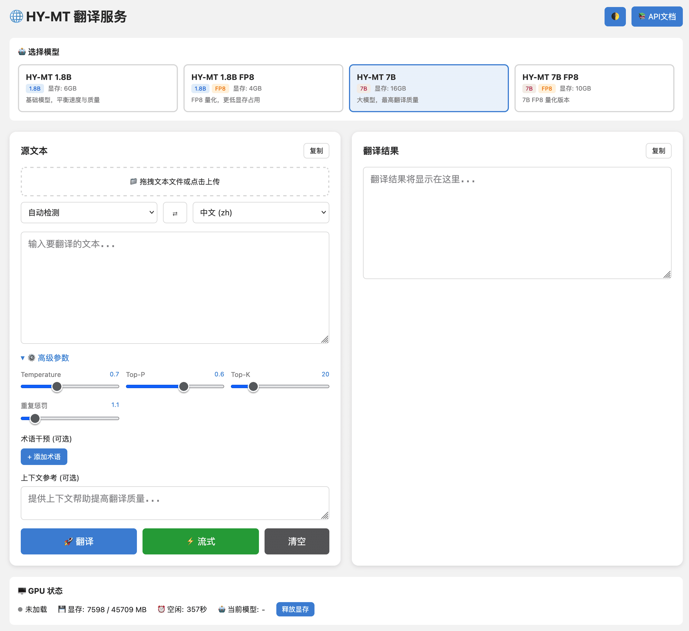

<p align="center">
  
</p>

<p align="center">
  <a href="README.md">English</a> | <a href="README_CN.md">简体中文</a> | <b>繁體中文</b> | <a href="README_JP.md">日本語</a>
</p>

<p align="center">
  <a href="https://hub.docker.com/r/neosun/hy-mt"></a>
  <a href="https://github.com/neosun100/hy-mt/stargazers"></a>
  <a href="https://github.com/neosun100/hy-mt/blob/main/License.txt"></a>
  <a href="https://huggingface.co/tencent/HY-MT1.5-1.8B"></a>
</p>

# HY-MT 翻譯服務

> 🚀 騰訊混元 HY-MT1.5 翻譯模型的 All-in-One Docker 部署方案，整合 Web UI、REST API 和 MCP Server。

## ✨ 功能特性

- 🌐 **38 種語言支援** - 中文、英語、日語、韓語、法語、德語、西班牙語等
- 🎨 **現代化 Web UI** - 深色/淺色主題切換、拖曳上傳、即時進度顯示
- ⚡ **串流翻譯** - Server-Sent Events (SSE) 即時輸出，長文本翻譯體驗更佳
- 🔧 **完整參數控制** - Temperature、Top-P、Top-K、重複懲罰等參數可調
- 📚 **術語干預** - 自訂術語對應，適用於專業領域翻譯
- 🤖 **MCP Server** - 支援 Model Context Protocol，可整合 Claude 等 AI 助手
- 🐳 **一鍵部署** - All-in-One Docker 映像檔，所有模型預裝
- 🔄 **智慧 GPU 管理** - 自動選擇 GPU、閒置逾時釋放顯存
- 🔀 **多模型支援** - 4 種模型自由切換（1.8B/7B，基礎版/FP8）

## 🎯 模型選擇指南

| 模型 | 顯存需求 | 速度 | 品質 | 推薦場景 |
|------|----------|------|------|----------|
| **HY-MT 7B** | 16GB | ⭐⭐⭐⭐ | ⭐⭐⭐⭐⭐ | 🏆 **首選** - 品質最高，速度也快 |
| HY-MT 1.8B | 6GB | ⭐⭐⭐⭐⭐ | ⭐⭐⭐⭐ | 顯存有限時的最佳選擇 |
| HY-MT 1.8B FP8 | 4GB | ⭐⭐⭐ | ⭐⭐⭐⭐ | 顯存極度受限（<6GB） |
| HY-MT 7B FP8 | 10GB | ⭐⭐ | ⭐⭐⭐⭐⭐ | 想要 7B 品質但顯存不夠 |

> 💡 **建議**：如果顯存 ≥16GB，直接用 **HY-MT 7B**，不用糾結。FP8 模型省顯存但會變慢（執行時需解壓縮）。

## 📸 介面截圖

<p align="center">
  
</p>

## 🚀 快速開始

### 方式一：Docker Run（推薦）

```bash
# 一條指令啟動（預設使用 7B 模型）
docker run -d --gpus all \
  -p 8021:8021 \
  -v ./models:/app/models \
  --name hy-mt \
  neosun/hy-mt:latest

# 存取 Web UI
open http://localhost:8021
```

Docker 映像檔（約 43GB）已包含所有 4 個模型，下載即用，無需額外下載！

### 方式二：Docker Compose

建立 `docker-compose.yml`：

```yaml
services:
  hy-mt:
    image: neosun/hy-mt:latest
    container_name: hy-mt
    ports:
      - "8021:8021"
    environment:
      - MODEL_NAME=tencent/HY-MT1.5-7B  # 推薦 16GB+ 顯存使用
      - GPU_IDLE_TIMEOUT=300
      - HF_ENDPOINT=https://huggingface.co
    volumes:
      - ./models:/app/models
    deploy:
      resources:
        reservations:
          devices:
            - driver: nvidia
              count: 1
              capabilities: [gpu]
    restart: unless-stopped
```

```bash
docker compose up -d
```

## 📋 環境需求

| 需求 | 最低配置 | 建議配置 |
|------|----------|----------|
| GPU | NVIDIA GPU 6GB+ 顯存 | 16GB+ 顯存（用 7B 模型） |
| CUDA | 11.8+ | 12.4+ |
| Docker | 20.10+ | 24.0+ |
| nvidia-docker | 必需 | - |

### 驗證 GPU 支援

```bash
# 檢查 NVIDIA 驅動程式
nvidia-smi

# 檢查 Docker GPU 支援
docker run --rm --gpus all nvidia/cuda:12.4.1-base-ubuntu22.04 nvidia-smi
```

## 📊 效能測試

測試環境：**NVIDIA L40S GPU**，翻譯方向：英文 → 中文

| 模型 | 短文本 (61字元) | 中等文本 (530字元) | 長文本 (1.8K字元) | 超長文本 (4.2K字元) |
|------|-----------------|-------------------|-------------------|---------------------|
| **HY-MT 7B** | 0.4s | 4.4s | 17.7s | 43.0s |
| HY-MT 1.8B | 0.4s | 3.6s | 14.0s | 32.3s |
| HY-MT 1.8B FP8 | 1.1s | 10.8s | 38.1s | 92.9s |
| HY-MT 7B FP8 | 2.9s | 28.5s | 115.6s | 274.1s |

### ⚠️ 為什麼 FP8 量化模型反而更慢？

這是一個**反直覺但符合技術原理**的現象：

| 對比 | 速度變化 | 原因 |
|------|----------|------|
| 1.8B FP8 vs 1.8B | 慢 **2.7 倍** | 執行時需要解壓縮 |
| 7B FP8 vs 7B | 慢 **6.4 倍** | 參數量更大，解壓縮開銷更大 |

**FP8 量化的目的是省顯存，不是加速！** 模型儲存為 8-bit，但 GPU 計算時需要動態解壓成 16-bit，這個過程在每個 token 生成時都會發生。

**什麼時候用 FP8：**
- ✅ 顯存受限時（7B 需 <16GB，1.8B 需 <6GB）
- ❌ 不適合追求速度
- ❌ 不適合批次處理（速度損失會累積）

詳見 [效能測試報告](docs/BENCHMARK_REPORT.md)。

## 🔑 關鍵優化：分段大小

**重要發現**：分段越小，翻譯品質越好

| 分段大小 | 品質 | 說明 |
|----------|------|------|
| 500 字元 | ❌ 差 | 中英混雜，模型「偷懶」 |
| 300 字元 | ⚠️ 一般 | 部分未翻譯 |
| **150 字元** | ✅ 優秀 | 翻譯完整準確 |

服務預設使用 `MAX_CHUNK_LENGTH=150` 以獲得最佳品質。

**原因**：HY-MT 模型對長輸入容易產生「偷懶」行為，只翻譯部分內容。短段落讓模型專注於完整翻譯每個句子。

詳見 [優化指南](docs/OPTIMIZATION_GUIDE.md)。

## ⚙️ 配置說明

### 環境變數

| 變數 | 預設值 | 說明 |
|------|--------|------|
| `PORT` | 8021 | 服務連接埠 |
| `MODEL_NAME` | tencent/HY-MT1.5-7B | HuggingFace 模型名稱 |
| `MODEL_PATH` | ./models | 本機模型快取路徑 |
| `GPU_IDLE_TIMEOUT` | 300 | GPU 閒置逾時自動釋放（秒） |
| `NVIDIA_VISIBLE_DEVICES` | 自動 | GPU ID（留空自動選擇） |
| `HF_ENDPOINT` | https://huggingface.co | HuggingFace 鏡像位址 |

### 使用 .env 檔案

```bash
# 複製範例配置
cp .env.example .env

# 編輯配置
vim .env
```

## 📖 API 使用

### 基礎翻譯

```bash
curl -X POST "http://localhost:8021/api/translate" \
  -H "Content-Type: application/json" \
  -d '{
    "text": "Hello, how are you?",
    "target_lang": "zh-Hant"
  }'
```

回應：
```json
{
  "status": "success",
  "result": "你好，你好嗎？",
  "elapsed_ms": 358,
  "model": "tencent/HY-MT1.5-7B",
  "chunks": 1
}
```

### 串流翻譯（SSE）

```bash
curl -N "http://localhost:8021/api/translate" \
  -H "Content-Type: application/json" \
  -d '{
    "text": "需要翻譯的長文章...",
    "target_lang": "en",
    "stream": true
  }'
```

### 術語干預

```bash
curl -X POST "http://localhost:8021/api/translate" \
  -H "Content-Type: application/json" \
  -d '{
    "text": "Apple released iPhone 16",
    "target_lang": "zh-Hant",
    "terms": {"Apple": "蘋果公司", "iPhone": "蘋果手機"}
  }'
```

輸出：`蘋果公司發布了蘋果手機16`

### 檔案上傳翻譯

```bash
curl "http://localhost:8021/api/translate/file" \
  -F "file=@document.txt" \
  -F "target_lang=zh-Hant" \
  -F "stream=true"
```

### 切換模型

```bash
curl -X POST "http://localhost:8021/api/models/switch" \
  -H "Content-Type: application/json" \
  -d '{"model": "tencent/HY-MT1.5-1.8B"}'
```

## 📚 API 端點

| 端點 | 方法 | 說明 |
|------|------|------|
| `/` | GET | Web UI 介面 |
| `/api/translate` | POST | 文字翻譯（支援串流） |
| `/api/translate/file` | POST | 檔案上傳翻譯 |
| `/api/translate/batch` | POST | 批次翻譯 |
| `/api/translate/stream` | POST | 串流翻譯（SSE） |
| `/api/languages` | GET | 支援的語言清單 |
| `/api/models` | GET | 可用模型清單 |
| `/api/models/switch` | POST | 切換翻譯模型 |
| `/api/gpu/status` | GET | GPU 狀態和顯存資訊 |
| `/api/gpu/offload` | POST | 釋放 GPU 顯存 |
| `/api/config` | GET | 服務配置資訊 |
| `/health` | GET | 健康檢查 |
| `/docs` | GET | Swagger API 文件 |

## 🌍 支援的語言

| 語言 | 代碼 | 語言 | 代碼 | 語言 | 代碼 |
|------|------|------|------|------|------|
| 中文 | zh | 英語 | en | 日語 | ja |
| 韓語 | ko | 法語 | fr | 德語 | de |
| 西班牙語 | es | 葡萄牙語 | pt | 俄語 | ru |
| 阿拉伯語 | ar | 泰語 | th | 越南語 | vi |
| 義大利語 | it | 荷蘭語 | nl | 波蘭語 | pl |
| 土耳其語 | tr | 印尼語 | id | 馬來語 | ms |
| 印地語 | hi | 繁體中文 | zh-Hant | 粵語 | yue |

以及更多 17 種語言，完整清單見 `/api/languages`。

## 🛠️ 技術棧

- **模型**: [Tencent HY-MT1.5](https://huggingface.co/tencent/HY-MT1.5-1.8B)（1.8B & 7B）
- **後端**: FastAPI + Uvicorn
- **前端**: 原生 JS + 深色/淺色主題
- **容器**: NVIDIA CUDA 12.4 基礎映像檔
- **串流**: Server-Sent Events (SSE)
- **MCP**: Model Context Protocol AI 整合

## 📁 專案結構

```
hy-mt/
├── app_fastapi.py      # FastAPI 主應用程式
├── mcp_server.py       # MCP Server（AI 助手整合）
├── benchmark.py        # 效能測試腳本
├── templates/
│   └── index.html      # Web UI（深色/淺色主題）
├── docs/
│   ├── BENCHMARK_REPORT.md    # 效能測試報告
│   ├── OPTIMIZATION_GUIDE.md  # 長文本優化指南
│   └── QUICK_REFERENCE.md     # API 快速參考
├── Dockerfile          # All-in-One Docker 建置
├── docker-compose.yml  # Docker Compose 配置
├── start.sh           # 快速啟動腳本
├── test_api.sh        # API 測試腳本
└── .env.example       # 環境變數範本
```

## 🔧 進階用法

### 本機開發執行

```bash
# 複製儲存庫
git clone https://github.com/neosun100/hy-mt.git
cd hy-mt

# 安裝相依套件
pip install torch transformers accelerate fastapi uvicorn

# 啟動服務
python -m uvicorn app_fastapi:app --host 0.0.0.0 --port 8021
```

### MCP Server 整合

在 Claude Desktop 等 AI 助手中使用，新增 MCP 配置：

```json
{
  "mcpServers": {
    "hy-mt": {
      "command": "python",
      "args": ["/path/to/hy-mt/mcp_server.py"],
      "env": {
        "HY_MT_API": "http://localhost:8021"
      }
    }
  }
}
```

支援的 MCP 工具：
- `translate` - 翻譯文字
- `list_languages` - 取得支援的語言清單
- `list_models` - 取得可用模型清單
- `switch_model` - 切換翻譯模型

詳見 [MCP_GUIDE.md](MCP_GUIDE.md)。

## 🐛 故障排除

| 問題 | 解決方案 |
|------|----------|
| 模型下載慢 | 設定 `HF_ENDPOINT=https://hf-mirror.com`（中國鏡像） |
| GPU 顯存不足 | 使用量化模型：`tencent/HY-MT1.5-1.8B-FP8` |
| 容器無法啟動 | 檢查 `nvidia-smi` 和 nvidia-docker 安裝 |
| 翻譯不完整 | 已優化，預設分段大小 150 字元 |
| 容器顯示 unhealthy | 等待 1-2 分鐘，模型載入中 |

## 📝 更新日誌

### v2.0.1 (2026-01-03)
- 🏆 預設模型改為 **HY-MT 7B**（品質最高、速度也快）
- 🩺 新增 Docker HEALTHCHECK，容器狀態可監控
- 📦 容器狀態顯示 `(healthy)` 表示服務就緒

### v2.0.0 (2026-01-03) - 真正的 All-in-One
- 🎯 **所有 4 個模型預裝在映像檔中**，下載即用
- 📦 映像檔大小：約 43GB
- 🏆 推薦：HY-MT 7B 品質最高、速度也快
- 📊 新增效能測試報告
- 🔧 新增 `benchmark.py` 效能測試腳本

### v1.2.0 (2026-01-03)
- 🔀 多模型支援（4 個模型：1.8B、1.8B-FP8、7B、7B-FP8）
- 🔄 UI 和 API 支援模型切換
- 📝 MCP Server 新增 `list_models` 和 `switch_model` 工具
- 🐛 修復翻譯回應中模型名稱顯示問題

### v1.0.0 (2026-01-03)
- 🎉 首次發布
- ✨ All-in-One Docker 映像檔
- ⚡ SSE 串流翻譯
- 🎨 深色/淺色主題 Web UI
- 🔧 長文本優化（分段 150 字元）
- 🤖 MCP Server 支援

## 🤝 貢獻指南

歡迎貢獻！請隨時提交 Pull Request。

1. Fork 本儲存庫
2. 建立特性分支 (`git checkout -b feature/AmazingFeature`)
3. 提交變更 (`git commit -m 'Add some AmazingFeature'`)
4. 推送到分支 (`git push origin feature/AmazingFeature`)
5. 提交 Pull Request

## 📄 授權條款

本專案基於 [騰訊混元 HunyuanMT](https://github.com/Tencent-Hunyuan/HY-MT)。詳見 [License.txt](License.txt)。

## 🙏 致謝

- [騰訊混元](https://github.com/Tencent-Hunyuan/HY-MT) - 原始 HY-MT 模型
- [HuggingFace](https://huggingface.co/tencent/HY-MT1.5-1.8B) - 模型託管

---

## ⭐ Star History

[](https://star-history.com/#neosun100/hy-mt)

## 📱 關注公眾號

<p align="center">
  
</p>
